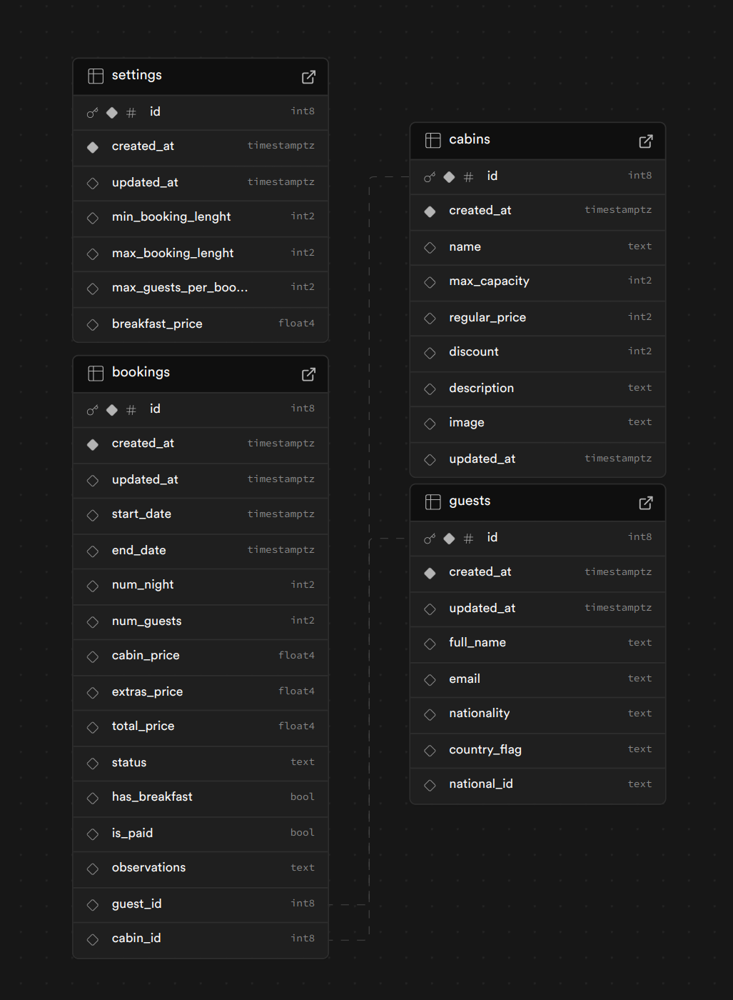

# The Wild Oasis

The Wild Oasis is a React app built with Vite, TypeScript, ESLint, Supabase and Prettier. It includes a minimal setup for React, TypeScript, and Vite, along with some ESLint rules and formatting with Prettier.

App is for small hotel with 8 luxurious wooden cabins. This is the internal application used to manage the cabins and their guests.

Main parts of the project:

- Internal application
- API
- Website to book cabins

## Main features

### Authentication employees only

- Sign up
- Sign in
- Sign out
- Reset password
- Change password

### Cabins

- List cabins
- Create cabins
- Update cabins
- Delete cabins

### Bookings

- List bookings
- Booking details
- Booking status

### Check-in and check-out

- Delete check-in and check-out
- Pay for check-in and check-out
- Adding breakfast option for entire stay

### Dashboard

- List of guests check-in and check-out on the current day
- Statistics for cabins, sales and bookings
- Charts for cabins, sales and bookings

### Settings

- breakfast price
- min and max booking days
- max guests per booking

## SUPABASE

### Database schema



### SQL for tables

#### bookings

```sql
create table
  public.bookings (
    id bigint generated by default as identity not null,
    created_at timestamp with time zone not null default now(),
    updated_at timestamp with time zone null,
    start_date timestamp with time zone null,
    end_date timestamp with time zone null,
    num_night smallint null,
    num_guests smallint null,
    cabin_price real null,
    extras_price real null,
    total_price real null,
    status text null,
    has_breakfast boolean null,
    is_paid boolean null,
    observations text null,
    guest_id bigint null,
    cabin_id bigint null,
    constraint bookings_pkey primary key (id),
    constraint bookings_cabin_id_fkey foreign key (cabin_id) references cabins (id),
    constraint bookings_guest_id_fkey foreign key (guest_id) references guests (id)
  ) tablespace pg_default;
```

#### cabins

```sql
create table
  public.cabins (
    id bigint generated by default as identity not null,
    created_at timestamp with time zone not null default now(),
    name text null,
    max_capacity smallint null,
    regular_price smallint null,
    discount smallint null,
    description text null,
    image text null,
    updated_at timestamp with time zone null,
    constraint cabins_pkey primary key (id)
  ) tablespace pg_default;
```

#### guests

```sql
create table
  public.guests (
    id bigint generated by default as identity not null,
    created_at timestamp with time zone not null default now(),
    updated_at timestamp with time zone null,
    full_name text null,
    email text null,
    nationality text null,
    country_flag text null,
    national_id text null,
    constraint guests_pkey primary key (id)
  ) tablespace pg_default;
```

#### settings

```sql
create table
  public.settings (
    id bigint generated by default as identity not null,
    created_at timestamp with time zone not null default now(),
    updated_at timestamp with time zone null,
    min_booking_lenght smallint null,
    max_booking_lenght smallint null,
    max_guests_per_booking smallint null,
    breakfast_price real null,
    constraint settings_pkey primary key (id)
  ) tablespace pg_default;
```

## Installation

```bash
git clone git@github.com:michallowkiet/the-wild-oasis.git
cd the-wild-oasis
npm install
npm run dev
```

#### Design by Jonas Schmedtmann [GitHub](https://github.com/jonasschmedtmann)
#### Code by Michał Łowkiet [GitHub](https://github.com/michallowkiet)